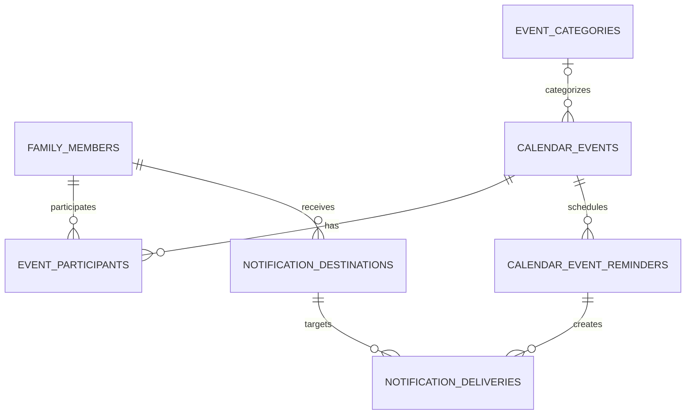

# Database and Drizzle

Family Hub uses PostgreSQL through Drizzle schema declarations in `app/src/db/schema.ts`; some calendar data access deliberately uses parameterized `pg` SQL in `app/src/lib/calendar-data.ts`. The checked-in migration history is `app/drizzle/`. Make schema changes through the Drizzle workflow, never as an unmanaged manual production mutation.

## Calendar and notification ER overview



| Table | Purpose and key relationships |
| --- | --- |
| `family_members` | Household participants and display colour metadata; unique name and active flag. Not auth users. |
| `event_categories` | Active/inactive named category metadata: unique name, required colour, optional icon. |
| `calendar_events` | Event payload, timestamptz start/end, all-day flag, optional location/category, and optional RRULE text. Category deletion sets `category_id` to null. |
| `event_participants` | Calendar-event ↔ family-member many-to-many join with composite primary key; both references cascade on delete. |
| `calendar_event_reminders` | Per-event reminder offsets. The database constrains offsets to 10, 30, 60, 1440, or 10080 minutes and prevents duplicate event/offset pairs. |
| `notification_destinations` | Per-member provider targets; provider/target is unique. |
| `notification_deliveries` | Durable delivery attempts for a reminder occurrence and destination; unique occurrence identity prevents duplicate deliveries. |

Event categories do have colour metadata today. The calendar UI deliberately chooses the first participant colour first, falls back to category colour, then a neutral colour; category colour remains available as metadata rather than the normal event-rendering colour. See `app/src/app/calendar/page.tsx`.

## Other current schema areas

- `shopping_items` stores the Family Hub shopping list.
- `spending_source_documents`, `spending_imports`, `spending_periods`, `spending_categories`, `spending_period_categories`, `spending_transactions`, `spending_reporting_groups`, and `spending_category_reporting_groups` preserve source-import identity, snapshots, optional transaction detail, and Family Hub reporting mappings.

These are committed schema, but detailed spending import semantics belong in [the spending import contract](issue-61-spending-import-contract.md). There is no household tenancy key across these tables because this is one household.

## Migrations

From `app/`, with a valid private `DATABASE_URL` and after a backup:

```bash
npm run db:generate
# inspect app/drizzle/ and its metadata; commit the intended migration
npm run db:migrate
```

In the Compose deployment, the one-shot `migrate` service runs `npm run db:migrate` before app and worker startup. Generation creates migration artifacts from `src/db/schema.ts`; applying runs the committed SQL in order. Review generated SQL, foreign keys, indexes, constraints, and rollback/recovery implications before applying it.

Manual `psql` schema edits bypass migration history and make deployments non-reproducible. Use them only for an emergency investigation with an explicitly documented corrective migration.

## Seeds

`npm run db:seed` runs `app/src/db/seed.ts`. It idempotently creates the current default family members and event categories by unique name. It requires `DATABASE_URL`; it is not run automatically by Compose. Treat seed content as baseline development/initialization data, not a replacement for an application data backup.

See [Backups and recovery](backups-and-recovery.md) before any migration.