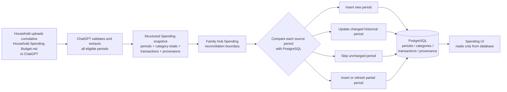
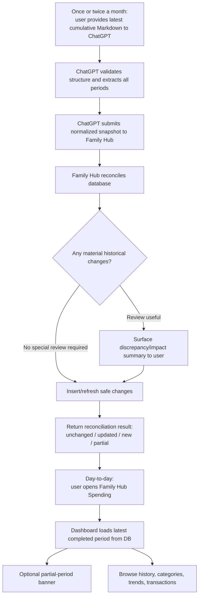
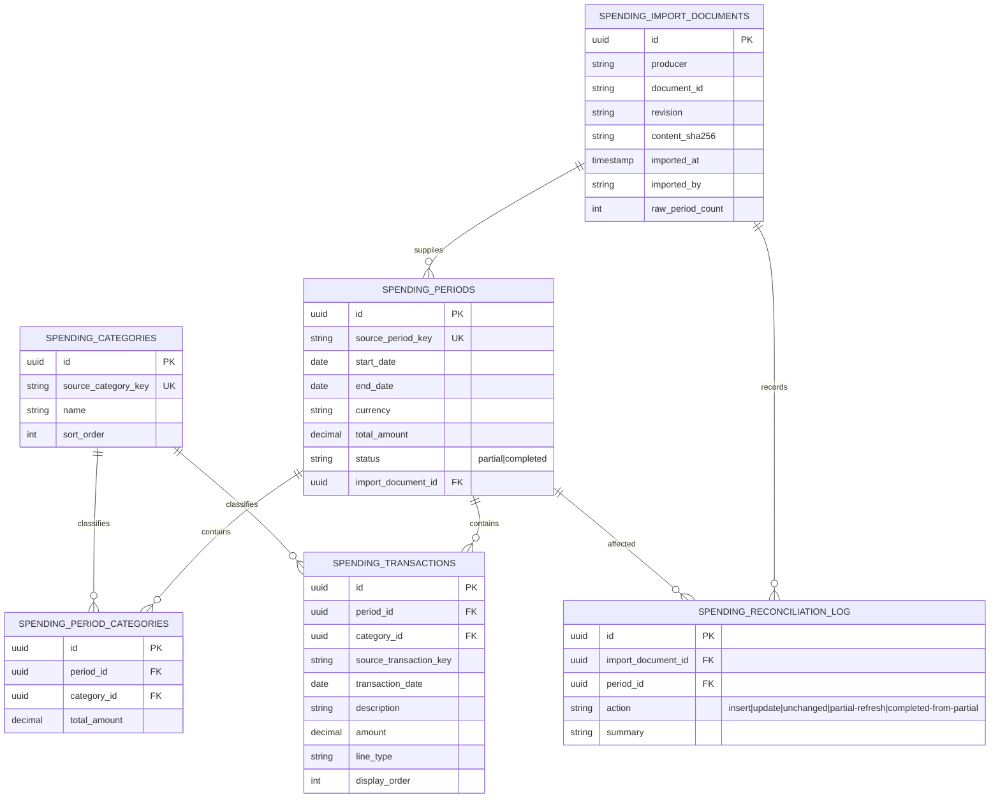

# Spending V2 design reference

This document captures the approved visual/interaction direction for the Spending V2 redesign described in [ADR-001](../../adr/ADR-001-spending-v2-agent-ingestion.md).

The generated planning mockups from the design discussion are represented here as implementation references so future tasks can work from a stable source in the repository. These are directional product designs, not pixel-perfect acceptance screenshots.

## 1. Data flow



**Key rule:** Markdown is an ingestion artifact, not a runtime dependency.

## 2. User flow



### Intended conversational result

```text
Spending import complete.

7 periods processed
5 unchanged
1 historical period updated
1 new completed period added
1 current partial period refreshed
```

## 3. Database direction

The exact migration must be based on the existing Spending schema rather than recreating tables unnecessarily. The approved target concepts are:



### Integrity direction

- One logical record per source period.
- Stable source-period identity based on source dates/keys.
- Deterministic transaction identity within a period.
- Changed-period replacement is atomic.
- Historical source classification is preserved.
- New categories require no schema migration.

## 4. Spending dashboard mockup direction

The approved UI direction is a **database-first dashboard with no normal upload box**.

### Mobile layout

```text
┌─────────────────────────────────────┐
│ HOUSEHOLD FINANCES                  │
│ Spending                            │
│ Track and understand household      │
│ spending                            │
├─────────────────────────────────────┤
│ August 2026              Completed  │
│ R57,409.87                          │
│ Total household spend               │
│ Last synced today via agent import  │
├───────────┬───────────┬─────────────┤
│ Categories│Transactions│ vs July    │
│    14     │    122    │   +1.1%     │
├─────────────────────────────────────┤
│ Spending by category                │
│                                     │
│            ◜████◝                   │
│          ██      ██                 │
│         ██  TOTAL  ██               │
│          ██      ██                 │
│            ◟████◞                   │
│                                     │
│ Groceries                 R10,803   │
│ Savings & Investments      R7,331   │
│ Municipal / Utilities      R5,506   │
│ Sahar Academics            R5,920   │
│ Home Loan / Bond           R3,811   │
├─────────────────────────────────────┤
│ Current period available            │
│ 28 Aug – 27 Sep     PARTIAL         │
│ View current spending →             │
├─────────────────────────────────────┤
│ Spending history                    │
│   ▂ ▅ ▃ ▆ ▅ █                       │
│  Mar Apr May Jun Jul Aug            │
├─────────────────────────────────────┤
│ Recent transactions                 │
│ Checkers                  -R583.42  │
│ Shell                   -R1,200.00  │
│ ...                                 │
└─────────────────────────────────────┘
```

### UI principles

- No Markdown/JSON upload control in the normal Spending page.
- Latest completed period is the default view.
- A current partial period is visible but clearly labeled as incomplete.
- Category cards/charts are dynamic; no fixed category list in code.
- Period totals and category totals come from authoritative stored source values.
- Historical trend visualizations use DB data, not source-document parsing.
- Transaction drill-down is easy to reach from categories and recent activity.
- Import freshness may appear as subtle provenance such as `Last synced via agent import`.
- Mobile and desktop follow existing Family Hub visual language: light background, rounded cards, dark navy headings, restrained blue accent, bottom/mobile navigation patterns.

## 5. Implementation boundary

```text
ChatGPT
   │ structured snapshot
   ▼
Family Hub API / MCP adapter
   │
   ▼
Shared Spending reconciliation service
   │
   ▼
Spending data/persistence layer
   │
   ▼
PostgreSQL
   ▲
   │ read APIs
   │
Spending UI
```

No presentation layer or agent adapter may bypass the shared Spending domain/service layer for persistence.

## 6. Legacy implementation

The original Spending issues and merged code remain part of repository history for traceability. V2 tasks may remove the legacy in-page ingestion code where it conflicts with this design while retaining useful schema, service, API, query, and UI foundations.
