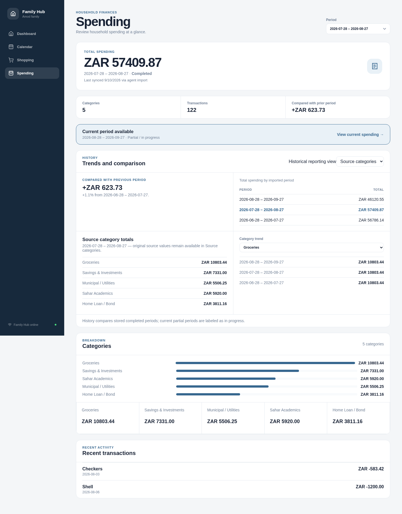
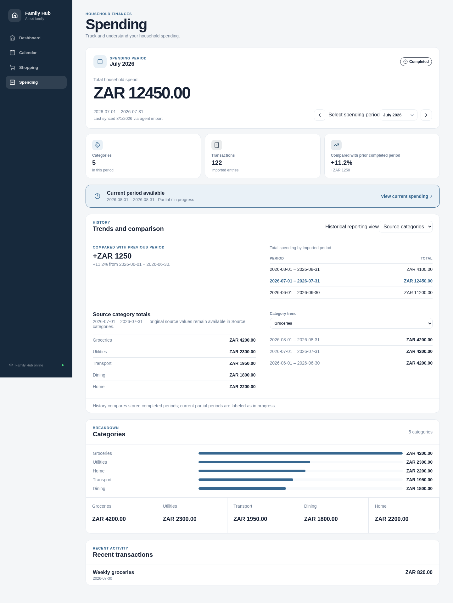
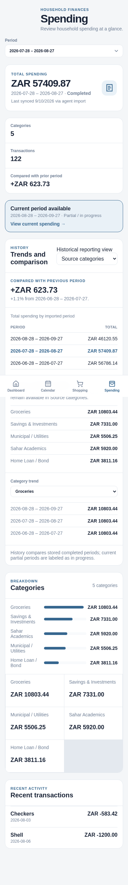
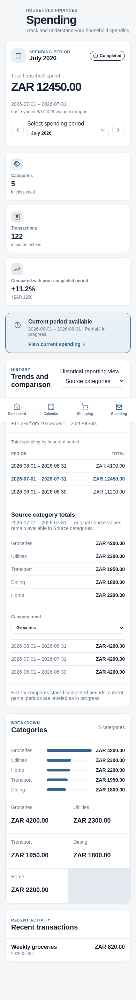

# Spending #107 visual review evidence

These deterministic local-fixture captures show the presentation change requested in #107. The fixture contains a completed July 2026 period, a partial current period, five categories, 122 transactions, and prior-period comparison data; no persistence or API contract was changed.

| Viewport | Before (`main`) | After (this PR) |
| --- | --- | --- |
| Desktop — 1440px wide |  |  |
| Mobile — 390px wide |  |  |

The after captures visibly include the Spending header, period hero (month/year, completion status, authoritative total, and sync freshness), previous/next controls plus period picker, three discrete metric cards, and the partial-period banner. The screenshots were generated locally against the PR build after it passed `npm run build`.
